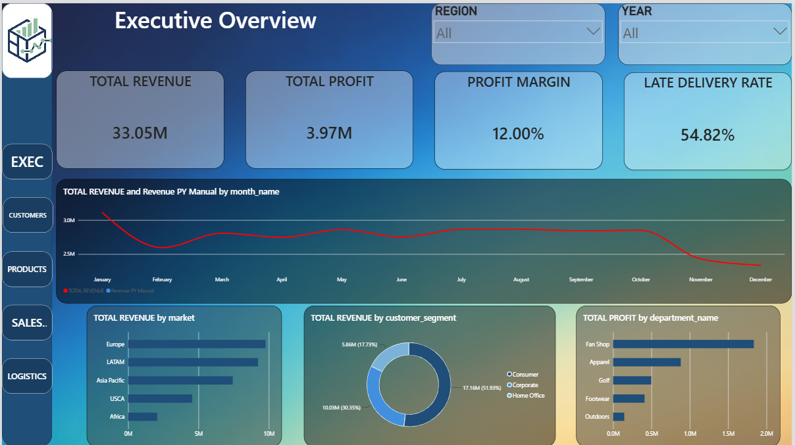
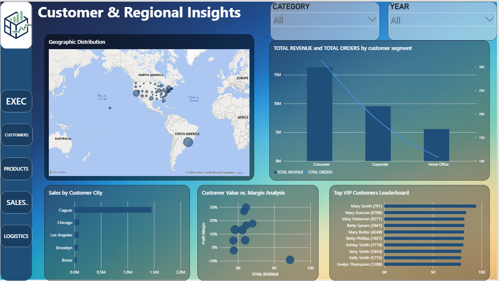
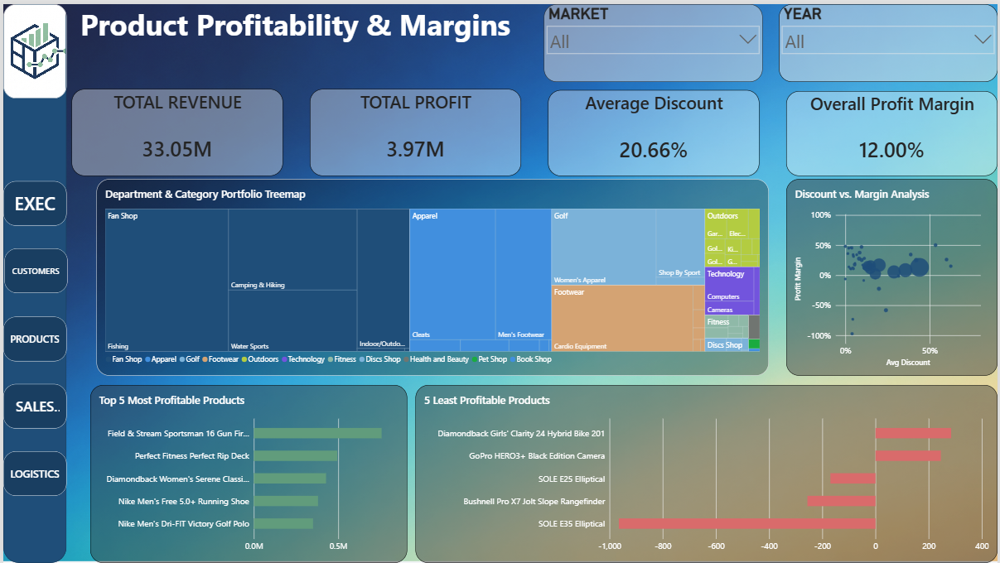
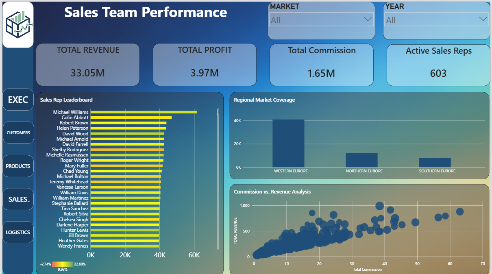
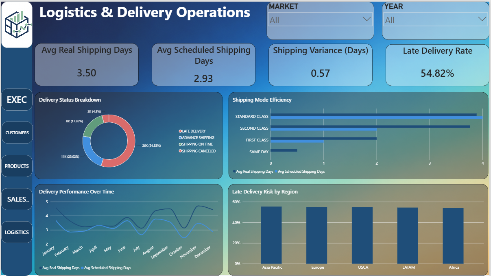

# SupplyChainDWH


> **An end-to-end supply chain data engineering and business intelligence platform built with SQL Server, T-SQL, Medallion Architecture, Kimball dimensional modeling, and Power BI.**

**Author:** Ibrahim Khalil

---

## 📌 Table of Contents

- [Executive Summary](#-executive-summary)
- [Project Overview](#-project-overview)
- [Architecture](#-architecture)
- [Medallion Architecture](#-medallion-architecture)
  - [Bronze Layer](#1-bronze-layer--ingestion--profiling)
  - [Silver Layer](#2-silver-layer--cleansing--standardization)
  - [Gold Layer](#3-gold-layer--dimensional-modeling)
- [Kimball Star Schema](#-kimball-star-schema)
- [Data Quality Engineering](#-data-quality-engineering)
- [Advanced DAX & Modeling Solutions](#-advanced-dax--modeling-solutions)
  - [Time Intelligence](#1-time-intelligence--previous-year-bypass)
  - [Customer Granularity](#2-customer-granularity--name-skew)
  - [Analytical Measures](#3-custom-analytical-measures)
- [Power BI Application](#-power-bi-application)
- [Dashboard Pages](#-dashboard-pages)
  - [Executive Overview](#1-executive-overview)
  - [Customer & Regional Insights](#2-customer--regional-insights)
  - [Product Profitability](#3-product-profitability--margins)
  - [Sales Team Performance](#4-sales-team-performance)
  - [Logistics Operations](#5-logistics--delivery-operations)
- [Tech Stack](#-tech-stack)
- [Project Execution](#-project-execution)
- [Repository Structure](#-repository-structure)
- [Code Highlights](#-code-highlights)
- [Business Insights](#-business-insights)
- [Engineering & Analytical Value](#-engineering--analytical-value)
- [Future Enhancements](#-future-enhancements)
- [Key Takeaways](#-key-takeaways)
- [Author](#-author)

---

# 🚀 Executive Summary

**SupplyChainDWH** is an end-to-end data engineering and business intelligence project designed to transform raw, inconsistent global supply chain and retail flat files into a structured analytical platform capable of supporting executive-level decision making.

The project implements a **Medallion Architecture entirely within SQL Server using pure T-SQL**, separating raw ingestion, data quality engineering, and analytical modeling into dedicated **Bronze, Silver, and Gold layers**.

The cleansed data is ultimately modeled using a **Kimball Star Schema**, consisting of a central `gold.fact_orders` table surrounded by reusable analytical dimensions for dates, customers, products, and sales representatives.

The Gold warehouse is then connected to **Power BI**, where a five-page interactive analytical application transforms the warehouse into an executive-facing decision-support system covering:

- Financial performance
- Customer value
- Geographic markets
- Product profitability
- Sales-team effectiveness
- Discount and margin behavior
- Delivery reliability
- Shipping performance
- Operational bottlenecks

The project goes beyond conventional dashboard development by addressing real-world analytical engineering problems, including:

- Dirty categorical data
- Hidden whitespace
- Inconsistent business classifications
- Duplicate category representations
- Orphan records
- Data-type inconsistencies
- Customer-level granularity problems
- Power BI time-intelligence limitations
- Filter-context challenges

The complete analytical lifecycle can therefore be summarized as:

```text
RAW DATA
    │
    ▼
DATA PROFILING
    │
    ▼
DATA QUALITY ENGINEERING
    │
    ▼
MEDALLION ARCHITECTURE
    │
    ▼
KIMBALL STAR SCHEMA
    │
    ▼
SEMANTIC MODEL
    │
    ▼
ADVANCED DAX
    │
    ▼
POWER BI APPLICATION
    │
    ▼
BUSINESS INSIGHTS
````

---

# 📊 Project Overview

Supply chain analytics requires more than simply aggregating sales data.

Raw operational datasets frequently contain:

* Inconsistent categorical values
* Duplicate representations of the same business entity
* Missing values
* Incorrect data types
* Orphaned records
* Hidden whitespace
* Inconsistent naming conventions
* Analytical granularity problems

If these issues reach the reporting layer, they can produce misleading KPIs, incorrect aggregations, broken relationships, and unreliable business conclusions.

SupplyChainDWH addresses these problems through a structured data engineering pipeline.

### Core Objective

> **Build a reliable analytical foundation that converts messy operational data into trusted, business-ready insights.**

The architecture separates responsibilities into four major stages:

| Stage        | Responsibility                                         |
| ------------ | ------------------------------------------------------ |
| **Bronze**   | Preserve and profile raw source data                   |
| **Silver**   | Clean, standardize, validate, and transform data       |
| **Gold**     | Build the analytical Star Schema                       |
| **Power BI** | Consume the Gold layer and deliver actionable insights |

---

# 🏗️ Architecture

## End-to-End Architecture

```text
┌──────────────────────────────────────────────┐
│       RAW SUPPLY CHAIN / RETAIL FILES        │
│                                              │
│  Flat Files • Operational Records • CSVs     │
└───────────────────────┬──────────────────────┘
                        │
                        ▼
┌──────────────────────────────────────────────┐
│                BRONZE LAYER                  │
│                                              │
│  Raw Ingestion                               │
│  Data Profiling                              │
│  Null Detection                              │
│  Anomaly Detection                           │
│  Orphan Identification                       │
│  Data-Type Inspection                        │
└───────────────────────┬──────────────────────┘
                        │
                        ▼
┌──────────────────────────────────────────────┐
│                SILVER LAYER                  │
│                                              │
│  TRIM / REPLACE / UPPER                      │
│  Missing-Value Handling                      │
│  Type Casting                                │
│  Category Standardization                    │
│  Duplicate Resolution                        │
│  Referential Integrity                       │
└───────────────────────┬──────────────────────┘
                        │
                        ▼
┌──────────────────────────────────────────────┐
│                 GOLD LAYER                   │
│                                              │
│          KIMBALL STAR SCHEMA                 │
│                                              │
│              ┌─────────────┐                 │
│              │ FACT ORDERS │                 │
│              └──────┬──────┘                 │
│                     │                        │
│       ┌─────────────┼─────────────┐          │
│       ▼             ▼             ▼          │
│   DIM DATE     DIM CUSTOMER    DIM PRODUCT   │
│                     │                        │
│                     ▼                        │
│               DIM SALESMAN                   │
└───────────────────────┬──────────────────────┘
                        │
                        ▼
┌──────────────────────────────────────────────┐
│                  POWER BI                    │
│                                              │
│  Semantic Model • DAX • KPIs • Visuals       │
│  Interactive Navigation • Business Insights  │
└──────────────────────────────────────────────┘
```

### Architectural Philosophy

The architecture intentionally separates four different concerns:

**Ingestion** → Preserve source fidelity.

**Quality Engineering** → Resolve structural and semantic data problems.

**Business Modeling** → Convert operational data into an analytical model.

**Consumption** → Expose the curated data through an interactive BI application.

This separation improves maintainability and makes it possible to trace analytical results back through the transformation pipeline.

---

# 🏛️ Medallion Architecture

## 1. Bronze Layer — Ingestion & Profiling

The Bronze layer represents the **raw landing zone** of the warehouse.

Source flat files were loaded into SQL Server with minimal transformation in order to preserve the original source information.

The primary responsibility at this stage was **observation rather than correction**.

### Data Profiling

The raw data was investigated for:

* Null and missing values
* Data-type mismatches
* Categorical anomalies
* Duplicate category representations
* Orphaned records
* Hidden trailing spaces
* Internal double-spaces
* Inconsistent capitalization
* Market naming inconsistencies
* Referential integrity issues

This profiling stage is critical because data quality problems are often invisible when looking at a dataset superficially.

For example:

```text
Europe
EUROPE
EU
EU 
```

may visually appear to represent the same business concept while technically behaving as separate categorical values.

### Why Preserve Raw Data?

The Bronze layer provides:

* **Traceability** — transformations can be traced back to source data.
* **Reproducibility** — cleansing logic can be rerun without requiring the original source files.
* **Auditability** — the original representation remains available for investigation.
* **Debugging** — unexpected Gold-layer results can be traced through previous transformations.
* **Separation of concerns** — ingestion is isolated from business logic.

The Bronze layer therefore acts as the controlled boundary between external operational data and the analytical warehouse.

---

# 2. Silver Layer — Cleansing & Standardization

The Silver layer transforms raw source records into a **trusted and standardized dataset**.

This stage contains the primary data quality engineering logic.

### Core Transformations

| Problem                     | Transformation                 |
| --------------------------- | ------------------------------ |
| Leading/trailing whitespace | `TRIM()`                       |
| Internal double-spaces      | `REPLACE()`                    |
| Inconsistent capitalization | `UPPER()`                      |
| Missing values              | Explicit business rules        |
| Incorrect data types        | `CAST()` / `CONVERT()`         |
| Duplicate categories        | Standardized mappings          |
| Inconsistent market names   | Canonical business values      |
| Orphan records              | Referential integrity handling |

### Market Standardization

One of the identified categorical problems involved multiple representations of the European market:

```text
EU
EUROPE
EU 
```

These values were consolidated into a single standardized business category:

```text
Europe
```

This prevents Power BI from treating logically identical markets as independent categories.

### Whitespace Normalization

Hidden whitespace can create extremely subtle analytical errors.

For example:

```text
"Europe"
"Europe "
"Europe  "
```

are different string values even though they appear almost identical to a human.

A representative cleansing transformation is:

```sql
SELECT
    UPPER(
        REPLACE(
            TRIM(market),
            '  ',
            ' '
        )
    ) AS normalized_market
FROM silver_source;
```

Additional business mapping can then convert normalized representations into canonical reporting values.

### Missing Values

Missing data was evaluated according to field semantics rather than blindly replacing every `NULL`.

The objective was to distinguish between:

* Genuinely unknown values
* Optional attributes
* Missing operational information
* Invalid records
* Values requiring business-standard defaults

This prevents data cleansing from introducing artificial information into the dataset.

### Data-Type Standardization

Explicit casting was performed before Gold-layer modeling to ensure that measures and relationships operate on predictable types.

Consistent data types are especially important for:

* Arithmetic calculations
* Aggregation
* Date filtering
* Relationship integrity
* DAX calculations
* Power BI semantic modeling

---

# 3. Gold Layer — Dimensional Modeling

The Gold layer contains the **business-ready analytical warehouse**.

Rather than exposing normalized operational structures directly to Power BI, the cleansed Silver data is transformed into a **Kimball Star Schema**.

### Gold Tables

```text
gold.fact_orders
gold.dim_date
gold.dim_customers
gold.dim_products
gold.dim_salesman
```

The model follows a classic dimensional architecture:

```text
                      ┌─────────────────┐
                      │   dim_date      │
                      └────────┬────────┘
                               │
                               │
┌─────────────────┐            ▼            ┌─────────────────┐
│ dim_customers   │──────► fact_orders ◄────│  dim_products   │
└─────────────────┘            ▲            └─────────────────┘
                               │
                               │
                      ┌────────┴────────┐
                      │  dim_salesman   │
                      └─────────────────┘
```

### Fact Table

`gold.fact_orders` represents the central transactional fact table.

It contains the measurable business events required for analytical reporting, including the measures and foreign keys necessary to analyze orders across multiple dimensions.

### Dimensions

#### `gold.dim_date`

Provides the calendar context required for:

* Yearly analysis
* Monthly analysis
* Trend analysis
* Previous-year comparisons
* Time-based filtering

The date dimension is configured as a proper Power BI date table to provide a reliable temporal foundation for analytical calculations.

#### `gold.dim_customers`

Contains customer-level descriptive attributes used to analyze:

* Customer value
* Segmentation
* Geography
* Customer rankings
* VIP customers

#### `gold.dim_products`

Contains product attributes supporting:

* Product analysis
* Departmental analysis
* Profitability
* Discount analysis
* Portfolio analysis

#### `gold.dim_salesman`

Contains sales-representative attributes supporting:

* Sales performance
* Commission analysis
* Regional coverage
* Incentive efficiency

---

# ⭐ Kimball Star Schema

The Gold model follows the principles of **Kimball dimensional modeling**.

### Key Design Decisions

* Central transactional fact table
* Conformed analytical dimensions
* Surrogate keys
* Clear dimensional grain
* 1-to-Many relationships
* Single-direction filter propagation
* Dedicated date dimension
* Separation of descriptive attributes from measurable events

### Why a Star Schema?

A Star Schema provides several advantages for Power BI:

1. **Simpler analytical queries**
2. **Predictable filter propagation**
3. **Reduced model complexity**
4. **Improved usability for BI developers**
5. **Clear separation between facts and dimensions**
6. **Efficient aggregation**
7. **Strong alignment with dimensional BI workloads**

Instead of forcing Power BI to interpret a complex operational schema, the Gold layer provides a semantic structure specifically designed for analytical consumption.

---

# 🧹 Data Quality Engineering

Data quality was treated as a core engineering responsibility rather than a final visualization step.

## Quality Problems Addressed

### Hidden Whitespace

```text
"Europe"
"Europe "
"Europe  "
```

These values can generate separate groups and distort aggregations.

**Solution:** `TRIM()` and `REPLACE()`.

### Inconsistent Categorization

```text
EU
EUROPE
EU 
```

**Solution:** Normalize the source values and map them to:

```text
Europe
```

### Duplicate Category Representations

Logically identical categories were identified during profiling and consolidated into canonical business values.

### Orphan Records

Records without valid parent entities were identified before populating the dimensional model.

This protects the Gold layer from broken analytical relationships.

### Data-Type Inconsistencies

Explicit type casting was performed before loading the Gold model.

This ensures predictable behavior during:

* Aggregation
* Joins
* Relationship creation
* DAX calculations
* Power BI rendering

---

# 🧠 Advanced DAX & Modeling Solutions

The Power BI layer involved more than creating standard measures.

Several analytical problems required understanding **filter context, granularity, relationship behavior, and time-intelligence mechanics**.

---

## 1. Time Intelligence — Previous Year Bypass

### The Problem

Standard Power BI time-intelligence functions such as:

```text
SAMEPERIODLASTYEAR()
DATEADD()
```

did not produce the required Previous Year comparison under the encountered filtering/schema conditions.

The issue was related to Power BI's date-filtering behavior and the requirement for a contiguous, appropriately interpreted date context.

Instead of forcing the standard functions to work around an unsuitable context, a custom calculation was designed to explicitly control the year filter.

### Solution Strategy

The custom approach:

1. Captures the selected year.
2. Calculates the previous year.
3. Removes the existing year filter.
4. Applies the required previous-year filter.
5. Recalculates revenue in that context.

A representative implementation is:

```DAX
Revenue PY =
VAR SelectedYear =
    SELECTEDVALUE ( dim_date[Year] )

VAR PreviousYear =
    SelectedYear - 1

RETURN
CALCULATE (
    [Total Revenue],
    REMOVEFILTERS ( dim_date ),
    dim_date[Year] = PreviousYear
)
```

The important engineering principle is not the syntax itself, but the explicit manipulation of **filter context**.

Rather than relying entirely on implicit time-intelligence behavior, the calculation explicitly defines which temporal context should be evaluated.

This made it possible to generate reliable PY trend comparisons for the Executive Overview page.

---

# 2. Customer Granularity & Name Skew

### The Problem

Customer names are not necessarily unique identifiers.

For example:

```text
Mary Smith
```

could represent multiple independent customers.

If a visual uses only:

```text
customer_fname + customer_lname
```

as the categorical field, Power BI can aggregate multiple customers under one displayed name.

This creates false analytical outliers.

A customer leaderboard could therefore incorrectly suggest that:

> **"Mary Smith" is an exceptionally valuable customer**

when the apparent value actually belongs to several different customer records.

### Solution

The customer identifier was appended to the displayed name.

A representative DAX implementation is:

```DAX
Customer Display Name =
    dim_customers[customer_fname]
        & " "
        & dim_customers[customer_lname]
        & " ["
        & FORMAT ( dim_customers[customer_id], "0" )
        & "]"
```

The resulting display becomes:

```text
Mary Smith [1024]
Mary Smith [1847]
Mary Smith [2315]
```

Each customer now retains a visually recognizable name while remaining analytically unique.

### Why This Is a Granularity Problem

This was fundamentally a **data-grain problem**, not a simple chart-formatting problem.

The analytical model operates at the customer-record level, while the visual was initially grouping by a non-unique descriptive attribute.

The solution therefore restores the correct analytical granularity by incorporating the unique identifier into the reporting dimension.

---

# 3. Custom Analytical Measures

The semantic model includes measures built using DAX functions and concepts such as:

* `DIVIDE()`
* `SUMX()`
* Variables
* Filter-context manipulation
* Dynamic calculations
* Context-aware aggregations

Representative analytical metrics include:

### Average Order Value

```DAX
Average Order Value =
DIVIDE (
    [Total Revenue],
    [Total Orders]
)
```

### Profit Margin

```DAX
Profit Margin =
DIVIDE (
    [Total Profit],
    [Total Revenue]
)
```

### Total Commission

Commission calculations use aggregation logic such as `SUMX()` where row-level commission calculations need to be evaluated before being aggregated.

These measures form the analytical foundation for the five dashboard pages.

---

# 📊 Power BI Application

Power BI serves as the **analytical consumption layer** on top of the SQL Server Gold warehouse.

The application contains **five interactive dashboard pages**, each targeting a different business domain.

The objective was not simply to display KPIs, but to create an analytical application capable of answering practical business questions.

---

# 🎨 UI/UX Design System

The dashboard follows a custom visual design language built around:

* Modern flat design
* Coastal gradient background
* Navy
* Azure
* Sage Green
* Transparent visual containers
* Minimalist visual hierarchy
* Persistent left-side navigation
* Custom transparent PNG navigation element
* Functional Home button
* Consistent page navigation
* Executive-oriented KPI presentation

### Design Philosophy

The visual design separates:

**Navigation**

from

**KPI hierarchy**

from

**Analytical visuals**

from

**Supporting context**

This creates a consistent application-like experience rather than five disconnected Power BI pages.

The design prioritizes:

* Readability
* Consistency
* Information density
* Visual hierarchy
* Fast executive interpretation
* Analytical exploration

---

# 📸 Dashboard Preview

The following screenshots showcase the five analytical pages of the Power BI application.

---

## 1. Executive Overview

The Executive Overview provides the highest-level view of business performance.



### Key Components

* Revenue KPI
* Profit KPI
* Profit Margin KPI
* Late Delivery Rate KPI
* Total Revenue trend
* Previous Year Revenue trend
* Executive performance indicators

### Revenue vs. Previous Year

A wide line chart compares:

```text
Total Revenue
       vs.
Revenue PY
```

The custom Previous Year DAX logic ensures that the two time series are evaluated using the intended year context.

### Business Purpose

This page answers:

> **"How is the business performing overall, financially and operationally?"**

It allows executives to identify high-level performance changes before drilling into customers, products, sales teams, or logistics.

---

# 🌍 2. Customer & Regional Insights

This page focuses on **who the customers are, where they operate, and how much value they generate**.



### Key Components

* Global geographic map
* Revenue by customer state
* Customer segment analysis
* Total Orders vs. Total Revenue combination chart
* VIP Customer Leaderboard
* Unique customer-ID display logic

### Volume vs. Value

The combination chart compares:

```text
Total Orders
      vs.
Total Revenue
```

This helps distinguish high-volume customer segments from high-value segments.

A segment may generate a large number of transactions without necessarily producing proportionally high revenue.

### VIP Customer Analysis

The customer uniqueness solution prevents identical names from being aggregated into false high-value customers.

### Business Purpose

The page answers:

> **"Who are our most valuable customers, and where is our revenue coming from?"**

---

# 💰 3. Product Profitability & Margins

This page focuses on product portfolio economics.



### Key Components

* Department-level Treemap
* Product portfolio analysis
* Average Discount vs. Profit Margin scatter plot
* Top 5 profitable products
* Bottom 5 products
* Divergent conditional formatting

### Discount vs. Margin Analysis

The scatter plot addresses the central business question:

> **"Are heavy discounts burning margins?"**

The visual allows products to be compared according to:

```text
Average Discount
        vs.
Profit Margin
```

This makes it possible to identify products where aggressive discounting may be associated with weak profitability.

### Top vs. Bottom Products

Conditional formatting highlights:

* Top 5 profitable products
* Bottom 5 bleeding/loss-making products

This creates an immediate distinction between products contributing positively to profitability and products requiring investigation.

### Business Purpose

The page answers:

> **"Which products create economic value, and where is discounting potentially eroding profitability?"**

---

# 👥 4. Sales Team Performance

This page analyzes sales representatives beyond simple revenue rankings.



### Key Components

* Active sales representatives
* Total commission
* Regional market coverage
* Commission Rate vs. Total Revenue scatter plot
* Sales representative leaderboard
* Dynamic color coding
* Margin contribution analysis

### Commission Efficiency

The scatter plot evaluates:

```text
Commission Rate
        vs.
Total Revenue
```

This helps determine whether higher incentive costs are translating into meaningful commercial performance.

### Dynamic Leaderboard

Sales representatives are dynamically ranked and visually differentiated according to their contribution.

The objective is to avoid treating gross sales as the only definition of success.

### Business Purpose

The page answers:

> **"Which sales representatives are generating efficient and profitable commercial performance?"**

---

# 🚚 5. Logistics & Delivery Operations

The Logistics Operations page focuses on supply chain reliability and delivery execution.



### Key Components

* Average Real Shipping Days
* Average Scheduled Shipping Days
* Actual vs. planned delivery performance
* Late Delivery Rate
* Custom donut charts
* Historical shipping bottleneck analysis
* Overlapping trend lines
* Shipping mode efficiency
* Global market logistics performance

## 54.82% Late Delivery Rate

One of the most significant operational findings is the identified:

> **54.82% late delivery rate**

This indicates a substantial gap between expected and actual delivery performance.

### Actual vs. Scheduled Shipping

The distinction between:

```text
Average Scheduled Shipping Days
```

and:

```text
Average Real Shipping Days
```

is critical.

A business may appear operationally efficient if it only tracks average shipping duration.

However, comparing actual performance against the planned schedule reveals whether the logistics network is meeting customer expectations.

### Historical Bottlenecks

Overlapping trend lines allow operational teams to investigate whether shipping delays are:

* Persistent
* Seasonal
* Market-specific
* Shipping-mode-specific
* Associated with particular operational periods

### Business Purpose

The page answers:

> **"Where is the logistics network failing to meet delivery expectations?"**

---

# 🖼️ Dashboard Gallery

For quick visual reference, the complete dashboard application is presented below.

### Executive Overview


### Customer & Regional Analytics


### Product Profitability


### Sales Team Performance


### Logistics Operations


---

# 🛠️ Tech Stack

| Technology                 | Role                                                           |
| -------------------------- | -------------------------------------------------------------- |
| **SQL Server**             | Data warehouse and database platform                           |
| **T-SQL**                  | Ingestion, cleansing, transformation, validation, and modeling |
| **Medallion Architecture** | Bronze/Silver/Gold data pipeline structure                     |
| **Kimball Star Schema**    | Dimensional analytical modeling                                |
| **Surrogate Keys**         | Stable dimension identity and relationship management          |
| **Power BI**               | Interactive BI and analytical consumption layer                |
| **DAX**                    | Measures, calculations, filter context, and time intelligence  |
| **Data Modeling**          | Semantic model, relationships, and analytical structure        |

### Why These Technologies?

**SQL Server** provides the centralized relational platform for the warehouse.

**T-SQL** enables the transformation pipeline to be implemented close to the data.

**Medallion Architecture** separates raw ingestion from cleansing and business-ready data.

**Kimball dimensional modeling** provides a structure optimized for analytical workloads.

**Surrogate keys** provide stable dimensional identifiers independent of potentially unreliable source identifiers.

**Power BI** provides interactive analytical exploration and executive reporting.

**DAX** enables calculations that cannot be represented through static SQL aggregations alone.

---

# 🔄 Project Execution

The implementation followed a complete analytical engineering lifecycle.

## Phase 1 — Source Ingestion

```text
Raw Flat Files
      ↓
SQL Server
      ↓
Bronze Tables
```

Source records were loaded with minimal transformation to preserve source fidelity.

---

## Phase 2 — Data Profiling

The Bronze data was inspected for:

* Nulls
* Data types
* Categorical anomalies
* Hidden whitespace
* Duplicate representations
* Orphan records
* Referential integrity problems

The objective was to understand the source before applying transformation logic.

---

## Phase 3 — Silver Transformation

Data quality rules were implemented using T-SQL.

```text
Raw Values
    ↓
Whitespace Normalization
    ↓
Category Standardization
    ↓
Missing-Value Handling
    ↓
Data-Type Casting
    ↓
Integrity Validation
    ↓
Silver Data
```

---

## Phase 4 — Dimensional Modeling

The standardized Silver data was transformed into:

```text
gold.fact_orders
gold.dim_date
gold.dim_customers
gold.dim_products
gold.dim_salesman
```

Surrogate keys and relationships were established to create the analytical Star Schema.

---

## Phase 5 — Power BI Connection

Power BI was connected to the Gold layer rather than directly to the raw operational structures.

This creates a clean separation:

```text
SQL Server
   │
   └── Gold Warehouse
          │
          ▼
       Power BI
```

---

## Phase 6 — Semantic Modeling

The Power BI model was configured with:

* Dimension-to-fact relationships
* Single-direction filtering
* Date table
* Analytical measures
* KPI logic
* Business calculations

---

## Phase 7 — Advanced DAX

Specialized DAX logic was developed to solve:

* Previous Year comparison
* Non-standard time filtering
* Customer-name aggregation skew
* Dynamic profitability calculations
* Commission calculations
* Late-delivery metrics

---

## Phase 8 — Dashboard Engineering

Five analytical pages were developed:

```text
01 Executive Overview
02 Customer & Regional Insights
03 Product Profitability
04 Sales Team Performance
05 Logistics Operations
```

The pages share a consistent design language and navigation framework.

---

## Phase 9 — Validation

The final model and dashboards were validated across:

* KPI totals
* Aggregations
* Relationships
* Filtering behavior
* Time-based calculations
* Customer-level granularity
* Business logic
* Visual consistency

The objective was to ensure that the numbers displayed in Power BI remain consistent with the underlying Gold warehouse.

---

# 📁 Repository Structure

```text
SupplyChainDWH/
│
├── DATA/
│   │
│   ├── Data handling.sql
│   │   
│   │   
│   │──Customers.csv
│   │──products.csv
│   │──salesman.csv   
│   │──orders.csv    
│       
│   
│   
│       
│       
│      
│
├── IMAGES/
│   ├── EXEC.png
│   ├── CUSTOMER.png
│   ├── PRODUCT.png
│   ├── SALES.png
│   └── LOGISTICS.png
│
├── pbix_file/
│   └── SupplyChainDWH.pbix
│
│
│   
│   
│   
│
├── README.md

```

> **Important:** The dashboard screenshots are referenced using repository-relative paths such as `IMAGES/EXEC.png`. The local Windows paths used during development (`C:\Users\...`) should **not** be placed in the GitHub README because they are only valid on the local machine.

This organization demonstrates a clear separation of concerns between:

```text
Ingestion
   ↓
Transformation
   ↓
Dimensional Modeling
   ↓
Business Intelligence
   ↓
Documentation
```

---

# 💻 Code Highlights

## T-SQL — Data Cleansing & Standardization

A representative transformation for normalizing categorical values:

```sql
SELECT
    CASE
        WHEN UPPER(
            REPLACE(
                TRIM(market),
                '  ',
                ' '
            )
        ) IN ('EU', 'EUROPE')
        THEN 'Europe'

        ELSE
            UPPER(
                REPLACE(
                    TRIM(market),
                    '  ',
                    ' '
                )
            )
    END AS standardized_market
FROM silver_source;
```

This combines:

* `TRIM()` → removes leading and trailing whitespace
* `REPLACE()` → removes hidden/internal double-spaces
* `UPPER()` → normalizes capitalization
* `CASE` → applies business-specific standardization

The result is a consistent analytical category rather than multiple technically different representations of the same market.

---

## DAX — Previous Year Revenue

A representative custom Previous Year calculation:

```DAX
Revenue PY =
VAR SelectedYear =
    SELECTEDVALUE ( dim_date[Year] )

VAR PreviousYear =
    SelectedYear - 1

RETURN
CALCULATE (
    [Total Revenue],
    REMOVEFILTERS ( dim_date ),
    dim_date[Year] = PreviousYear
)
```

The key design principle is explicit filter-context control.

Rather than relying entirely on standard time-intelligence functions, the measure explicitly establishes the desired temporal context.

---

## DAX — Unique Customer Display Name

```DAX
Customer Display Name =
    dim_customers[customer_fname]
        & " "
        & dim_customers[customer_lname]
        & " ["
        & FORMAT ( dim_customers[customer_id], "0" )
        & "]"
```

This preserves human-readable customer names while preventing identical names from collapsing into a single analytical category.

---

## DAX — Profit Margin

```DAX
Profit Margin =
DIVIDE (
    [Total Profit],
    [Total Revenue]
)
```

Using `DIVIDE()` provides safer handling of zero or blank denominators than direct division.

---

## DAX — Average Order Value

```DAX
Average Order Value =
DIVIDE (
    [Total Revenue],
    [Total Orders]
)
```

This measure allows revenue performance to be analyzed independently from transaction volume.

---

# 💡 Business Insights

The purpose of the platform is not merely to produce charts.

The analytical model enables stakeholders to move from **observations to decisions**.

---

## 1. 🚚 Significant Logistics Risk

The dashboard identifies a:

> **54.82% late delivery rate**

### What It Means

More than half of the analyzed deliveries are classified as late according to the modeled delivery logic.

### Potential Business Action

Management can investigate:

* Shipping modes
* Markets
* Regions
* Historical periods
* Scheduled-vs-actual shipping gaps

The next analytical step would be to isolate the dimensions contributing most heavily to the late-delivery rate.

---

## 2. 👑 More Accurate VIP Customer Identification

Customer names are not reliable unique identifiers.

The customer-ID solution prevents:

```text
Mary Smith
```

from becoming an artificial high-value customer created by aggregating several different records.

### Business Value

Stakeholders can identify actual individual VIP customers and make better decisions regarding:

* Retention
* Account management
* Customer segmentation
* Targeted promotions
* Revenue concentration

---

## 3. 💸 Potential Margin Erosion from Discounting

The Product Profitability page directly evaluates:

```text
Average Discount
        vs.
Profit Margin
```

### Business Question

> **Are aggressive discounts generating enough additional revenue to compensate for the margin they destroy?**

Products showing high discount levels alongside weak margins should be candidates for pricing and promotional review.

---

## 4. 🎯 Sales Incentive Efficiency

Commission rates are evaluated against revenue rather than looking only at sales volume.

This makes it possible to identify cases where:

* High commission costs generate strong revenue
* High commission costs generate weak revenue
* High revenue is achieved efficiently
* Sales representatives contribute meaningfully to profitability

The business can therefore move from:

> **"Who sold the most?"**

toward:

> **"Who generated the most efficient commercial value?"**

---

# 🧠 Engineering & Analytical Value

SupplyChainDWH demonstrates a complete transition from raw operational data to business decision support.

## End-to-End Engineering

The project covers:

* Raw data ingestion
* Data profiling
* Data quality engineering
* SQL-based ETL
* Medallion Architecture
* Dimensional modeling
* Surrogate keys
* Referential integrity
* Semantic modeling
* Advanced DAX
* Dashboard engineering
* Business analytics

---

## Problem-Solving Depth

The project demonstrates the ability to troubleshoot problems across multiple layers.

### Data Layer

```text
Dirty Data
   ↓
Profiling
   ↓
Cleansing
   ↓
Standardization
```

### Warehouse Layer

```text
Cleansed Data
   ↓
Dimensional Modeling
   ↓
Surrogate Keys
   ↓
Fact + Dimensions
```

### Semantic Layer

```text
Star Schema
   ↓
Relationships
   ↓
Measures
   ↓
Filter Context
```

### BI Layer

```text
Semantic Model
   ↓
DAX
   ↓
Visual Analytics
   ↓
Business Insights
```

This demonstrates that the project is not simply a collection of SQL queries or Power BI charts.

It represents an integrated analytical platform:

> **Raw Data → Data Quality → Data Warehouse → Semantic Model → Analytics → Business Decision**

---

# 🔮 Future Enhancements

The current implementation provides the core analytical architecture.

Potential future enhancements include:

### ⚙️ ETL & Orchestration

* Automated ETL orchestration
* SQL Server Agent scheduling
* Metadata-driven pipelines
* Incremental loading
* Automated refresh monitoring

### 🧪 Data Quality

* Automated data-quality testing
* Data-quality scorecards
* Schema validation
* Automated anomaly detection
* Data observability

### 🏛️ Dimensional Modeling

* Slowly Changing Dimensions
* Historical attribute tracking
* Expanded conformed dimensions
* More advanced warehouse auditing

### ☁️ Cloud Architecture

Potential migration paths could include:

```text
SQL Server
    ↓
Azure Data Factory
    ↓
Azure SQL / Synapse
    ↓
Power BI
```

### 🚀 BI Engineering

* Power BI deployment pipelines
* CI/CD for SQL and BI assets
* Automated semantic-model validation
* Centralized workspace governance
* Refresh monitoring

> **Note:** These are future architectural enhancements and are not claimed as components of the current implementation.

---

# 🏆 Key Takeaways

SupplyChainDWH demonstrates how an analytical system can be engineered as a complete pipeline rather than as an isolated reporting solution.

### The Project Demonstrates

```text
┌──────────────────────────────┐
│        RAW DATA              │
└──────────────┬───────────────┘
               ↓
┌──────────────────────────────┐
│      DATA PROFILING          │
└──────────────┬───────────────┘
               ↓
┌──────────────────────────────┐
│   DATA QUALITY ENGINEERING   │
└──────────────┬───────────────┘
               ↓
┌──────────────────────────────┐
│   MEDALLION ARCHITECTURE     │
└──────────────┬───────────────┘
               ↓
┌──────────────────────────────┐
│    KIMBALL STAR SCHEMA       │
└──────────────┬───────────────┘
               ↓
┌──────────────────────────────┐
│      SEMANTIC MODEL          │
└──────────────┬───────────────┘
               ↓
┌──────────────────────────────┐
│        ADVANCED DAX          │
└──────────────┬───────────────┘
               ↓
┌──────────────────────────────┐
│       POWER BI APP           │
└──────────────┬───────────────┘
               ↓
┌──────────────────────────────┐
│     BUSINESS INSIGHTS        │
└──────────────────────────────┘
```

The strongest aspect of the project is the connection between **engineering correctness and analytical usefulness**.

The warehouse is not built merely to store data.

The DAX is not written merely to produce numbers.

The dashboard is not designed merely to look attractive.

Each layer exists to ensure that the final business insight is:

**traceable → standardized → modeled → calculated → visualized → actionable.**

---

# 👤 Author

## Ibrahim Khalil

**Data Engineering • Data Analytics • Business Intelligence • Artificial Intelligence**

This project represents an end-to-end portfolio implementation focused on building reliable data pipelines, dimensional warehouses, analytical semantic models, and decision-oriented BI applications.

---
